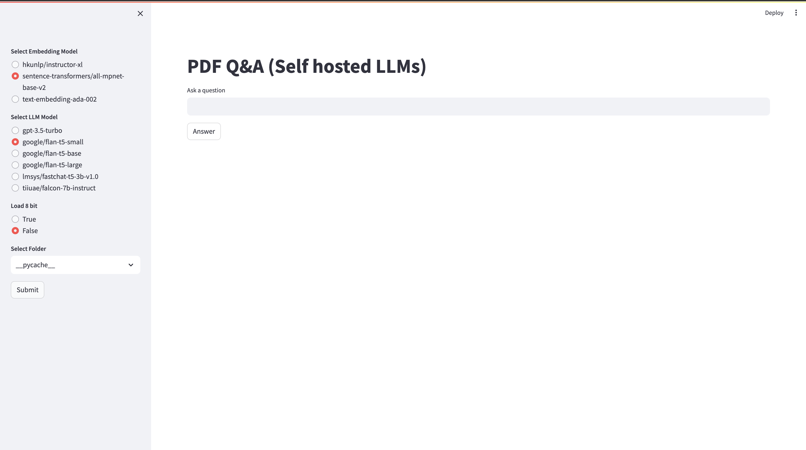
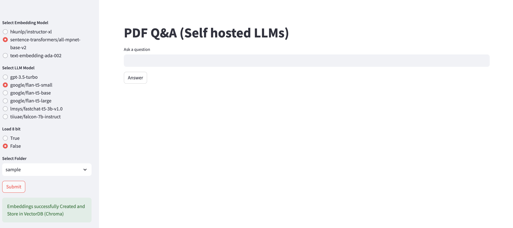
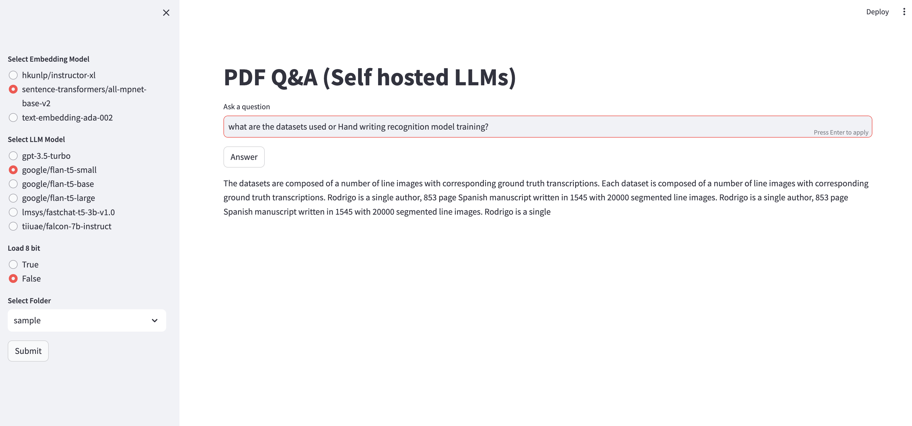

# Archieve_QnA
RAG based QnA on multiple documents using opensource LLMs or OpenAI gpt3.5turbo

## Environment Set up and invoke app
A shell script is made to set up the environment and invoke the QnA application. The application uses models from open ai or hugging face.

To use the models from open ai, Set up openai gpt3.5turbo model access by updating the OpenAI API secret key in the ```constants.py``` as below.
```
OPENAI_API_KEY = ' ' #OpenAI api seceret key
```

To launch the app,
Step -1 Place the pdf files to be indexed in the directory ```Archieve_QnA```

Step -2 run the below command

```
sh run.sh
```
The above step may take a while to create the environment and launch the app. The streamlit app opens up in the localhost as below



From the options in the left pane, Please choose the following

* Select an embedding model from the options
    - ```hkunlp/instructor-xl``` or ```sentence-transformers/all-mpnet-base-v2``` to use open source models from hugging face
    - ```text-embedding-ada-002``` to use open ai model
 
* Select an LLM model from the options
    - ```google/flan-t5-small``` or  ```google/flan-t5-base``` or ```google/flan-t5-large``` or ```lmsys/fastchat-t5-3b-v1.0``` or ```tiiuae/falcon-7b-instruct``` to use open source models from hugging face
    - ```gpt-3.5-turbo``` to use open ai model
 
* If any open source model is selected, you can load the model in 8-bit.
* In the drop down to Select Folder, the folder of pdf files will be shown if it is in the local directory. Select the folder and Submit

**Note:**
This may take arounf 20 mins to inde and store 100 pdf files as vector database in a cpu machine.

Once the embeddings are generated and ready for QnA, the page looks like below


The QnA bot is ready to answer the questions related to the pdf files uploaded. A sample completion is as below



 **Please note that the performance of the model is not as accurate as possible with open source models but using gpt3.5 yeilds better results**

### References:
1. [Talk to your Database using RAG and LLMs](https://medium.com/@shivansh.kaushik/talk-to-your-database-using-rag-and-llms-42eb852d2a3c)
2. [Advanced Retrieval for AI with Chroma](https://www.deeplearning.ai/short-courses/advanced-retrieval-for-ai/)
3. [Vector stores using Langchain](https://python.langchain.com/docs/modules/data_connection/vectorstores/)
4. [Indexing using Langchain](https://python.langchain.com/docs/modules/data_connection/indexing/)

